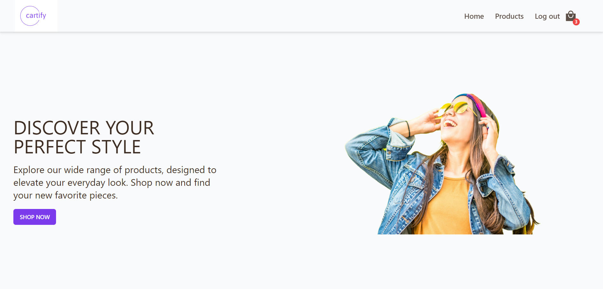
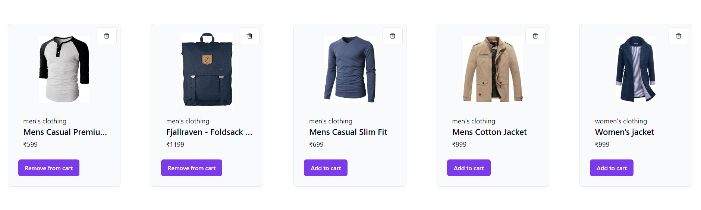
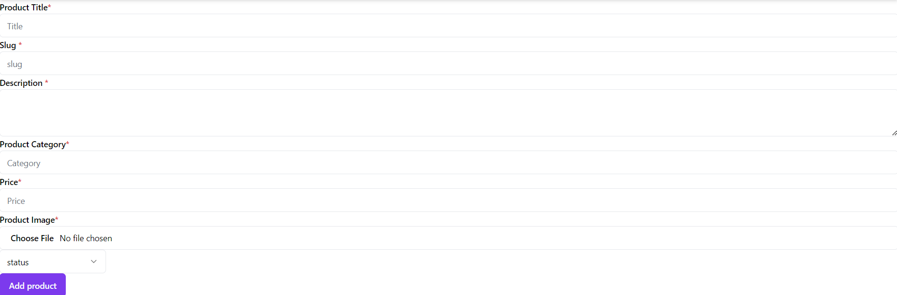
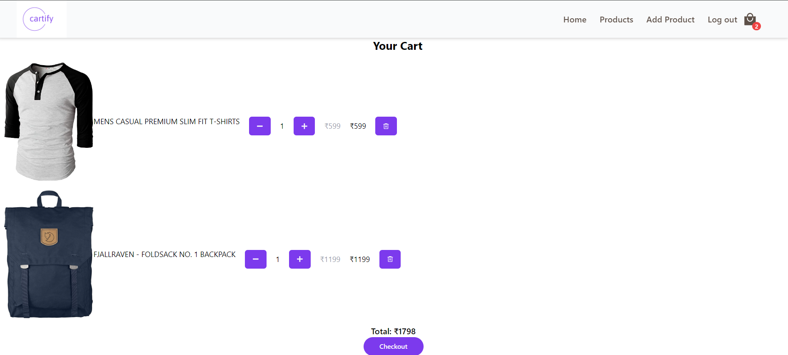
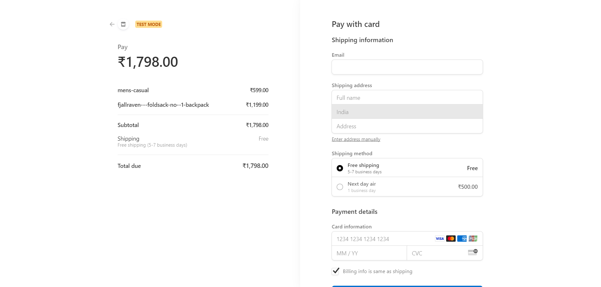

# E-commerce Website

A **feature-rich e-commerce platform** offering product listing, shopping cart management, and secure payment processing. Built with modern technologies to provide an optimal user experience for both shoppers and store owners.


## Tech Stack

- **Frontend**: React, TailwindCSS, Shadcn
- **State Management**: Redux
- **Backend**: Appwrite (BaaS)
- **Payment Gateway**: Stripe
- **Form Validation**: Zod
- **Deployment**: Vercel
## Features

- **Product Management**: Store owners can create, update, and delete products, offering full control over product listings.
- **Shopping Cart**: Users can add items to the cart, adjust quantities, and remove products, with real-time total cost updates.
- **Secure Payments**: Integrated **Stripe** for payment processing, ensuring a secure and seamless checkout experience.
- **Input Validation**: Implemented **Zod** for robust form and data validation, enhancing user trust and security.
- **Secure Backend**: Managed user authentication and data storage with **Appwrite**, ensuring secure backend services.
- **Responsive Design**: Optimized for all devices using **TailwindCSS**, ensuring smooth user experience on desktops, tablets, and mobile devices.

## Screenshots








## Run Locally

Clone the project

```bash
  git clone https://github.com/Uzairkazi695/full-stack-ecommerce.git
```

Go to the project directory

```bash
  cd full-stack-ecommerce
```

Install dependencies

```bash
  npm install
```

Start the server

```bash
  npm run dev
```


## Environment Variables

To run this project, you will need to add the following environment variables to your .env file

`VITE_APPWRITE_URL`

`VITE_APPWRITE_PROJECT_ID`

`VITE_APPWRITE_DATABASE_ID`

`VITE_APPWRITE_COLLECTION_ID`

`VITE_APPWRITE_CART_COLLECTION_ID`

`VITE_APPWRITE_CUSTOMER_COLLECTION_ID `

`VITE_APPWRITE_BUCKET_ID`

`VITE_APPWRITE_FUNCTION_ID `

`VITE_APPWRITE_FUNCTION_PROJECT_ID`

`VITE_APPWRITE_API_KEY`

`VITE_STRIPE_SECRET_KEY`

`VITE_STRIPE_WEBHOOK_SECRET`


## Roadmap

- **User Reviews**: Add reviews and ratings for products.
- **Order History**: Implement order tracking and history for users.
- **Wishlist**: Add wishlist functionality for saving favorite products.


## Contributing

Contributions are always welcome!


## License

This project is licensed under the  [MIT](https://choosealicense.com/licenses/mit/) License.

